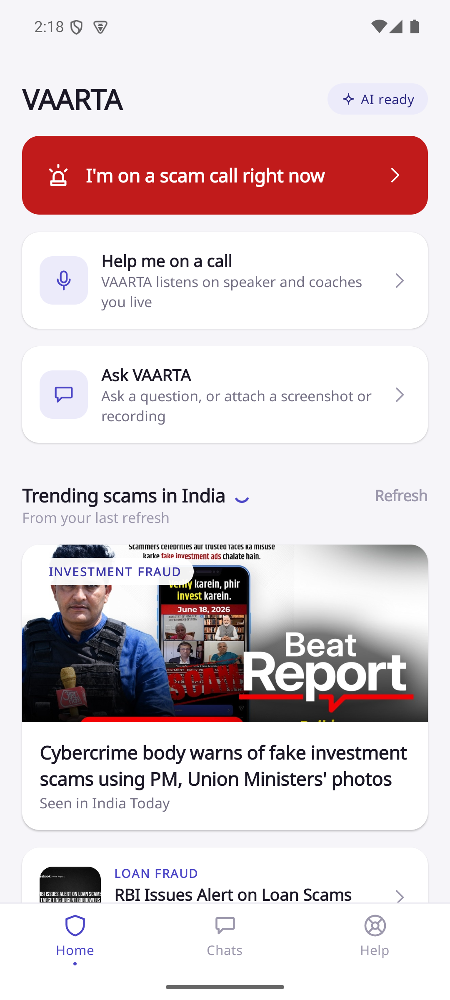
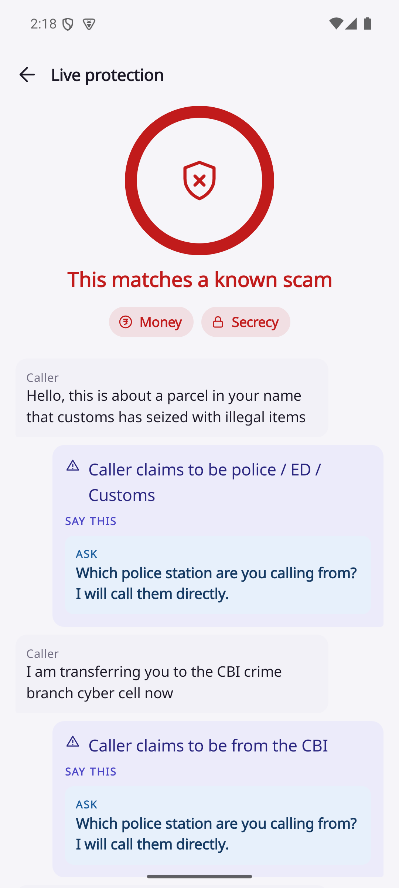
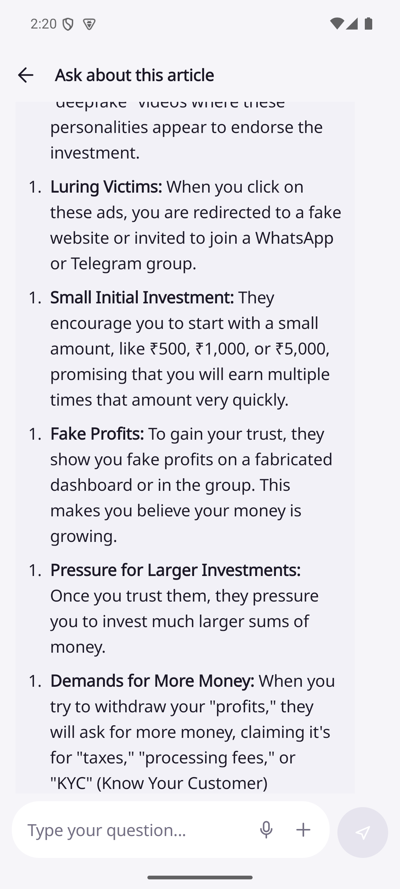
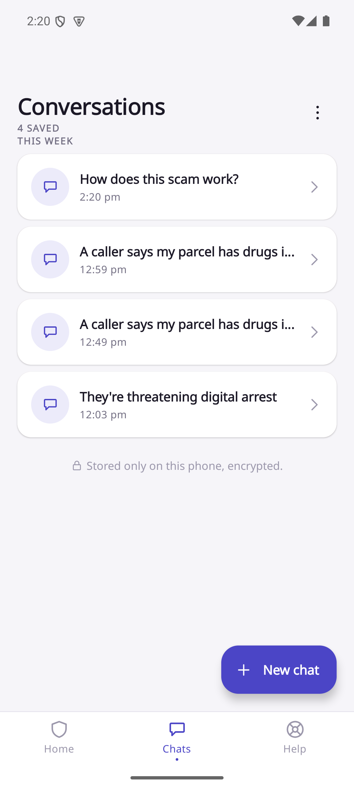
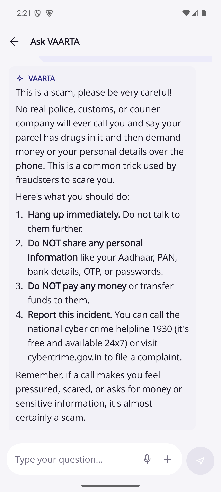
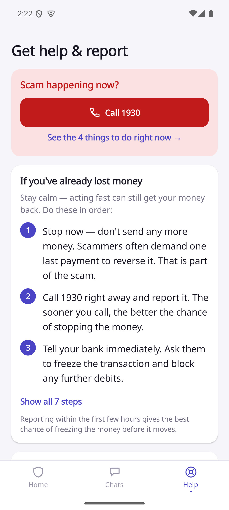
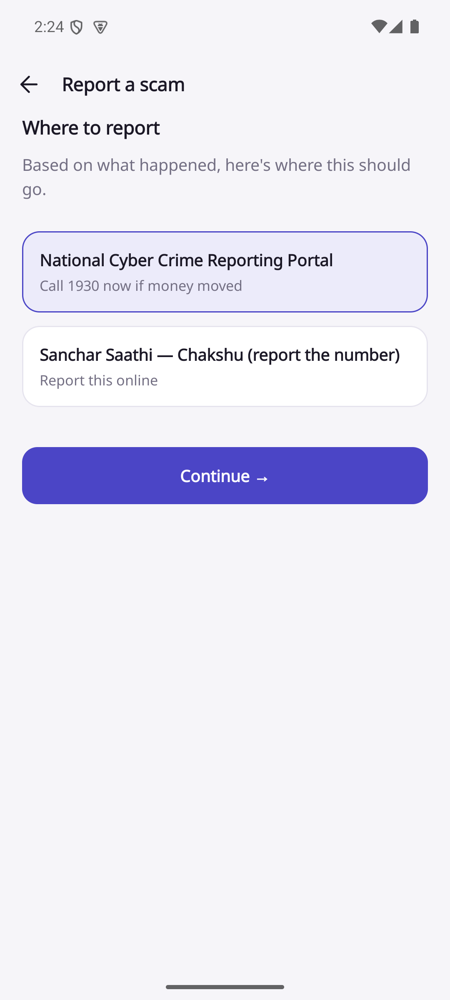
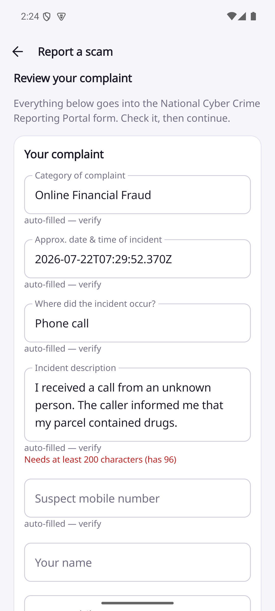
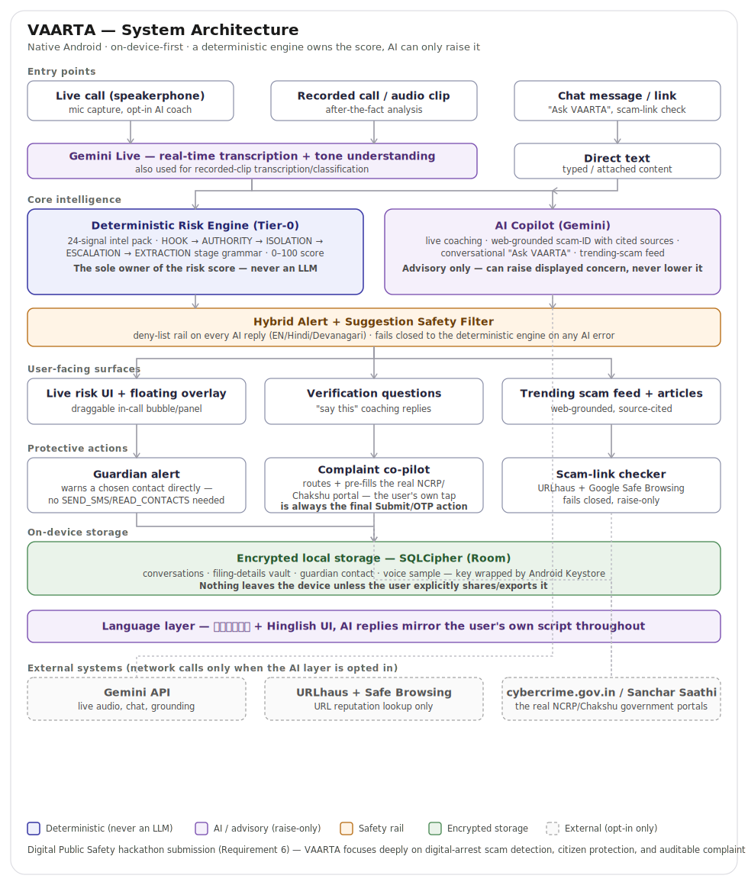

# VAARTA

**Real-time, on-device protection against digital-arrest and phone scams for Indian citizens.**

VAARTA listens to a suspicious call live (on speaker), scores it as it escalates with a
deterministic risk engine, coaches the caller's intended victim on exactly what to say back with
an AI copilot, warns their family, and helps them file an auditable complaint with the real
government cybercrime portals — end to end, on a single Android phone, at zero infrastructure cost.

Built for **Theme: AI for Digital Public Safety — Defeating Counterfeiting, Fraud & Digital Arrest
Scams**, with deep, complete coverage of the *Digital Arrest Scam Detection & Alerting* and
*Citizen Fraud Shield* pillars.

---

## The problem

India logged **1.14 million cybercrime complaints in 2023** — up 60% year-on-year — and "digital
arrest" scams alone, where fraudsters impersonating police, CBI, or Customs officers hold victims
hostage over video call, cost citizens **over ₹1,776 crore in just the first nine months of 2024**.
These are industrialised operations, and the intelligence gap isn't evidence after the fact — it's
protection *at the point of contact*, before a victim ever transfers a rupee.

## The solution

VAARTA turns a phone into its own protector. A citizen puts a suspicious call on speaker; VAARTA
listens, transcribes, and scores the conversation against a scam-progression model in real time —
entirely on-device. If the pattern matches a known scam, the app tells the victim exactly what to
say to break the scammer's script, offers to alert a trusted family member, and — if money has
already moved — walks them through filing a real complaint with the correct government authority,
autofilling the live portal so nothing gets lost in translation between panic and paperwork.

## Screenshots

<table>
<tr>
<td align="center" width="25%"><br/><sub><b>Home</b><br/>panic action, AI status, live scam-news feed</sub></td>
<td align="center" width="25%"><br/><sub><b>Live protection</b><br/>a real scam call scored and coached in real time</sub></td>
<td align="center" width="25%"><br/><sub><b>Ask VAARTA</b><br/>grounded, cited AI answers</sub></td>
<td align="center" width="25%"><br/><sub><b>Conversations</b><br/>encrypted history of every call, chat, and recording</sub></td>
</tr>
<tr>
<td align="center"><br/><sub><b>Safety guidance</b><br/>clear, actionable steps for the specific scam described</sub></td>
<td align="center"><br/><sub><b>Get help &amp; report</b><br/>emergency steps and lost-money recovery guidance</sub></td>
<td align="center"><br/><sub><b>Report a scam</b><br/>automatic routing to the correct government portal</sub></td>
<td align="center"><br/><sub><b>Auto-filled complaint</b><br/>ready to review before filing</sub></td>
</tr>
</table>

## Key features

- **Deterministic risk engine** — a 5-stage scam-progression grammar (HOOK → AUTHORITY →
  ISOLATION → ESCALATION → EXTRACTION) scores a live transcript 0–100. A real scam call reliably
  escalates to a **SCAM_PATTERN** verdict; a genuine police callback ("your FIR is registered")
  correctly stays low. This asymmetry — the engine's core discriminator — is a zero-tolerance
  regression gate in the test suite, and the score is **never** set by an LLM, so it can't be
  hallucinated.
- **24-signal scam-intelligence pack** (English / Hindi / Hinglish) covering digital-arrest,
  courier/parcel seizure, SIM-block threats, bank/RBI laundering accusations, investment/job/loan/
  lottery/electricity/UPI-refund lures, courier-COD OTP scams, bank KYC-expiry phishing, and
  family-emergency impersonation — 10 distinct scam families in total.
- **Live AI copilot** (Gemini Live) — hears the call, understands tone and words, and coaches the
  victim in real time with graded replies (ask a verifying question, refuse, or end the call) and
  a live-updating "why this is suspicious" breakdown, shown in-app or in a floating overlay that
  stays visible over the dialer.
- **Zero-enrollment speaker attribution** — an on-device voice-embedding model (no cloud, no signup)
  learns to tell the user's own voice apart from the caller's during a session, so a victim reading
  a suggested reply aloud can never accidentally re-trigger or pin the risk score.
- **Recorded-call & article analysis** — no live call needed: pick any recorded clip and VAARTA
  transcribes, classifies, and scores it through the same deterministic engine; tap any trending-scam
  story for a structured, source-cited explainer (what it is / how to spot it / what to do).
- **Conversational "Ask VAARTA"** — a multimodal assistant (text, voice, photo, or audio-clip
  attachments) that answers any question about a suspicious call or message with grounded, cited,
  plain-language answers — in the exact script the user typed in.
- **Guardian alert** — warns one chosen family contact directly, with no `SEND_SMS` or
  `READ_CONTACTS` permission required at all.
- **Complaint co-pilot** — an intelligent, guided "Report a scam" flow, scoped to the specific
  call/recording/chat it's reporting. It routes automatically to the correct real government
  destination — NCRP (cybercrime.gov.in) or Chakshu (Sanchar Saathi) — pre-fills the form from a
  reusable, encrypted filing-details vault, and autofills the *live* portal inside an in-app
  browser, with a one-tap PDF/text export always available too. **The user's own tap is always the
  final Submit/OTP/CAPTCHA action — VAARTA never submits on a user's behalf.**
- **Scam-link checker** — chat messages and shared links are checked against URLhaus and Google
  Safe Browsing before the user opens them.
- **Encrypted on-device storage** — every saved conversation, the filing-details vault, and the
  guardian contact are encrypted at rest (SQLCipher, key wrapped by Android Keystore). Nothing
  leaves the device unless the user explicitly shares or exports it.
- **हिन्दी + Hinglish**, first-class — an in-app language picker, every AI reply mirrors whatever
  script the user is typing in, and a dedicated safety filter checks AI output in English, Hindi,
  and Devanagari script alike before it ever reaches a frightened user.
- **Polished, accessible interface** — full dark-mode support, TalkBack/screen-reader labels on
  every interactive element, and layouts stress-tested at large font scales.

Every AI surface is advisory-only, layered strictly on top of the deterministic engine: the AI can
**raise** displayed concern, never lower it or set the score itself, and any AI failure fails closed
to the deterministic-only experience — a network hiccup degrades gracefully, it never breaks safety.

**284 automated tests, 0 failures, 0 lint errors** (fresh, reproducible count — clean rebuild,
counted directly from JUnit XML, not asserted).

## Architecture



A deterministic engine is the sole owner of the risk score; the AI copilot sits alongside it as an
advisory layer that can only raise concern, never lower or set it, and every AI output passes a
safety rail before reaching the user. Protective actions (coaching, guardian alert, complaint
filing, link checking) and all persistence are on-device; the only network calls are opt-in calls
to the AI provider, two URL-reputation services, and — only when the user chooses to file — the
real government portals themselves.

## Tech stack

| Layer | Technology |
|---|---|
| Platform | Native Android (Kotlin, Jetpack Compose, Material 3) |
| Deterministic engine | Pure Kotlin/JVM (`core:reasoning`) — fully unit-tested, no Android dependency |
| AI copilot | Google Gemini (live audio, chat, web-grounded classification) |
| Speaker attribution | On-device sherpa-onnx (CAM++ embedding model), zero-enrollment |
| Persistence | Room + SQLCipher, key wrapped by Android Keystore |
| Threat intel | URLhaus, Google Safe Browsing |
| Government integration | NCRP (cybercrime.gov.in), Sanchar Saathi (Chakshu) |
| Build | Gradle (Kotlin DSL), CLI-only — no Android Studio required |

## Getting started

**Prerequisites:** JDK 17, Android SDK (platform 35, build-tools 35+) with `local.properties`
pointing at it. No Android Studio required — this project builds and tests entirely from the CLI.

```bash
git clone https://github.com/Megesh07/vaarta.git
cd vaarta

# Run every unit test (pure JVM + Room-instrumented where noted, no device needed for the JVM ones):
./gradlew test

# Build the Android debug APK:
./gradlew :app:assembleDebug
# → app/build/outputs/apk/debug/app-debug.apk (sideload onto an Android 10+ device or emulator)
```

### Enabling the AI layer (optional)

The app builds and protects with **zero external services** — the deterministic risk engine,
complaint export, and encrypted history all work fully offline with no API key. The AI copilot and
scam-link checker are opt-in and need free keys:

1. Copy `secrets.properties.example` to `secrets.properties` (repo root, git-ignored — never
   committed) and fill in what you want to enable:
   - `GEMINI_API_KEY` — free at [aistudio.google.com/apikey](https://aistudio.google.com/apikey).
     Enables the AI copilot (live suggestions, chat, scam-type identification).
   - `SAFE_BROWSING_API_KEY` — free non-commercial-tier key at
     [developers.google.com/safe-browsing/v4/get-started](https://developers.google.com/safe-browsing/v4/get-started).
   - `URLHAUS_AUTH_KEY` — free key at [auth.abuse.ch](https://auth.abuse.ch/).
   - Either key alone is enough to enable the scam-link checker; both together give it two
     independent threat-intel sources.
2. Rebuild — `./gradlew :app:assembleDebug`. Leave a key blank and the corresponding feature is
   simply absent from the UI; nothing else changes.

## Trying it out

```bash
# Boot an emulator (Pixel 6 profile, API 35, google_apis, x86_64 — what this project is built against):
emulator -avd vaarta_test -no-snapshot

adb install -r app/build/outputs/apk/debug/app-debug.apk
adb shell am start -n ai.vaarta.debug/ai.vaarta.MainActivity
```

From there: **Home → "Get live help from VAARTA" → "Watch how it works"** plays a scripted demo
call that escalates live to a red **SCAM_PATTERN** shield with coaching replies and an "Alert
family" button — the fastest way to see the full detection pipeline end to end.

## Validation

- **Deterministic engine:** the scam-vs-genuine-call asymmetry is pinned by full multi-turn
  transcript tests for every supported scam family, not single-line assertions.
- **End-to-end:** every user-facing flow — live coaching, the floating overlay, recorded-call
  analysis, the encrypted conversation history, the guardian alert, and the complaint co-pilot's
  live autofill against the real NCRP/Chakshu portals — has been driven and verified on an Android
  emulator, screenshot by screenshot (the screenshots above are from a real, current build).
- **AI safety:** the coaching safety filter has been red-teamed with a dedicated adversarial test
  suite across both English/Hinglish and Devanagari script.

## Scope

VAARTA goes deep on two of the challenge's five illustrative pillars — **Digital Arrest Scam
Detection & Alerting** and the **Citizen Fraud Shield** — rather than spreading thin across all
five. Counterfeit-currency detection, fraud-network graph intelligence, and geospatial crime
mapping are deliberately out of scope for this submission; VAARTA is designed as one deep,
production-shaped module of that broader Digital Public Safety platform.

Built strictly at **$0** — no backend, no paid APIs, no infrastructure cost — by design: an
on-device-first architecture is not just cheaper, it's what makes protection available instantly,
offline, and privately, to every citizen with a phone.

## License

MIT — see [LICENSE](LICENSE).
